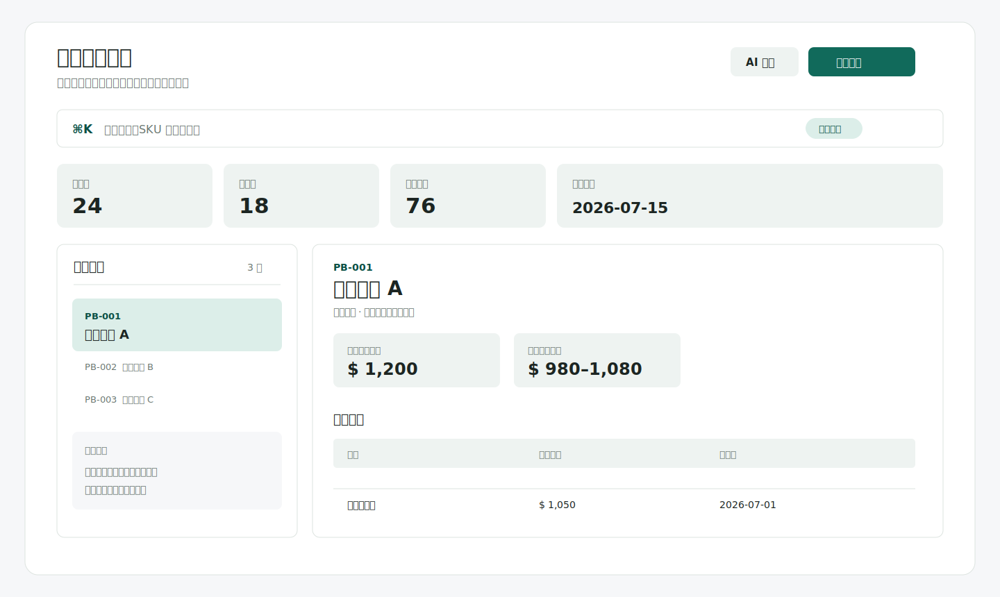

# Pricebook 產品價格管理系統

> 集中管理產品定價、客戶別售價與價格異動紀錄，讓查價與報價追蹤更有效率。

[線上體驗](https://t16104021.github.io/pricebook/) · [功能說明](#核心功能) · [技術架構](#技術架構與資料安全)

想直接瀏覽系統介面而不登入，可開啟[作品展示模式](https://t16104021.github.io/pricebook/?demo=1)。展示模式使用去識別化測試資料，僅提供查詢與瀏覽。

> 上圖使用測試資料呈現，不包含實際客戶、產品或報價資訊。

## 專案簡介

Pricebook 是一套以網頁為主的產品價格管理系統，協助使用者建立產品資料、維護客戶別報價，並以時間軸追蹤每次價格異動。系統亦提供 Excel 資料匯入匯出與 LINE 查價流程，讓產品與客戶價格能更快被查找與使用。

## 核心功能

- **產品與客戶別價格管理**：集中維護產品定價、客戶售價、生效日與備註。
- **快速搜尋與異動追蹤**：可依產品、客戶或近期異動篩選，並透過時間軸查看價格紀錄。
- **Excel 匯入與匯出**：支援將既有資料轉入系統，也可匯出整理後的資料。
- **帳號登入與資料隔離**：透過 Supabase Auth 與 Row Level Security，讓不同帳號只能存取自己的資料。
- **LINE 查價**：可透過指定格式查詢客戶與產品價格，取得固定格式的查價結果。
- **AI 輔助話術**：在不影響固定查價結果的前提下，選配 AI 產生第二則回覆話術。

## 技術架構與資料安全

| 項目 | 使用技術 |
| --- | --- |
| 前端 | HTML、CSS、JavaScript |
| 登入與資料庫 | Supabase Auth、PostgreSQL、Row Level Security |
| 資料處理 | Excel 匯入與匯出、產品與價格歷程資料模型 |
| 通訊整合 | LINE Messaging API、Supabase Edge Functions |
| AI 輔助 | Gemini / OpenAI API，僅用於改寫回覆話術 |
| 部署 | GitHub Pages |

- 產品與客戶價格資料儲存於 Supabase，不儲存在 GitHub repository。
- 前端使用者依帳號權限讀寫自己的資料；LINE 查價功能亦有簽名與使用者權限檢查。
- AI 僅取得查價回覆所需的最小資料，用於文字表達；不會取得產品定價、價格日期或完整資料庫。

## 專案連結

- 線上作品（公開展示版）：[https://t16104021.github.io/pricebook/?demo=1](https://t16104021.github.io/pricebook/?demo=1)
- 原始碼：[https://github.com/t16104021/pricebook](https://github.com/t16104021/pricebook)
